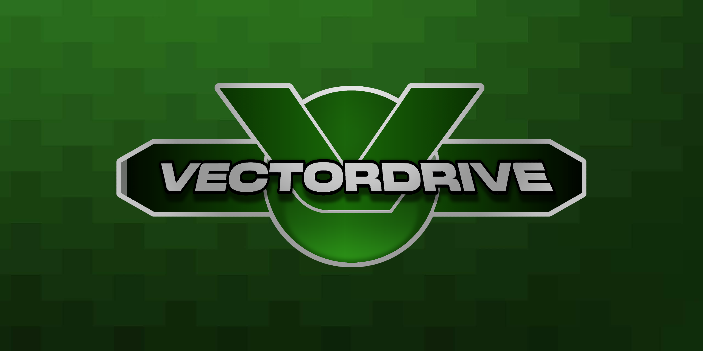

# VectorDrive

A fork of PicoDrive for PSP, skinned to look like Sonic's Ultimate Genesis Collection

### Why?

In 2019 (when i originally had this idea) i had just gotten a PSP, and in 2016-2020 i had a copy of Sonic's UGC on the Xbox 360, i knew that the PSP was very much powerful enough to run the same library of games, and this was on the back of my head until August of 2024, when i started this project, then realized it was too ambitious for my skills back then. **But now, in August of 2026, i have officially finished this project**

**Fun Fact** - I did make a **terrible** version of this idea in 2019 with my limited brain, which i still have archived today, (i stretched the SUGC logo to fit on the PBP, changed the background which made the game list almost unreadable, and a few other horrible hacks), but, it didn't involve any source code. This time i'm doing it for real, redesigning the UI and open sourcing all of it

### Downloads

#### 1. Pre-built with ROMs (Recommended)

1. Go to [vectordrive.sollium.net](https:/vectordrive.sollium.net) and click "Download"
2. Select which variant you want (VectorDrive / Sonic's UGC / SEGA MDUC)
3. Select what version you want (Memory Stick / ISO), then download it
4. Copy that to your PSP or PS Vita like any other game
5. Run it from the XMB! Enjoy!

#### 2. Custom Version (VectorForge)

1. Go to [vectordrive.sollium.net](https:/vectordrive.sollium.net) and click "Download"
2. Select which variant you want (VectorDrive / Sonic's UGC / SEGA MDUC)
3. Select "NoROM Edition" then download it
4. Scroll down, find "VectorForge", then pick your platform (Windows / Linux)
5. Run VectorForge, then hit "Add Folder" and select a folder with your SEGA ROMs
6. Pick which library you want to add it to (main / extra). Do it twice if you want both.
7. Click "Scrape", then type in your [ScreenScraper.fr](https://screenscraper.fr) credentials
8. Wait until it's done. after that, go to "Builder", select the VectorDrive ZIP you downloaded
9. Click "Build ZIP" and/or "Build ISO", and navigate to the folder where you saved it
10. Copy that to your PSP or PS Vita like any other game, and run it from the XMB! Enjoy!

### To-do List (Finished)

| Done     | Feature               | Progress |
|----------|-----------------------|----------|
| ✅ (M1)  | ISO Support           | 100%     |
| ✅ (M1)  | Game List             | 100%     |
| ✅ (M2)  | Title Screen          | 100%     |
| ✅ (M2)  | Backgrounds           | 100%     |
| ✅ (M2)  | SRAM in SAVEDATA      | 100%     |
| ✅ (M3)  | Retro Dreams BGM      | 100%     |
| ✅ (M3)  | Theme Switching       | 100%     |
| ✅ (M4)  | ROM Selector UI       | 100%     |
| ✅ (M5)  | ROM Metadata UI       | 100%     |
| ✅ (V1)  | Customizer Tool       | 100%     |
